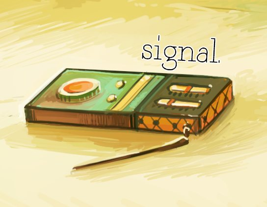

# Signal

Signal is a game jam game made for Global Game Jam 2018. It is a point and click adventure game with four puzzles, and a short framing story threaded through the game.

Signal uses the Unity engine. Checkouts from this repository are known to be buildable with Unity 2017.3.0f3.

The soundtrack is available on SoundCloud: https://soundcloud.com/floatingfast/sets/signal

## Team Members

In alphabetical order,

* Dietrich Epp (@DietrichEpp): Programming

* Rachel Geng (@koloquials): Art

* Jaden Horsfield (@maotousarms): Writing, Has Purple Hair, Moral Support

* Nyusha Iampolski (@f.f0000): Art

* Michael Poltronieri Tang (@RealMichaelTang): Programming, Voice

* Aneudis Salcedo: Programming

* Demetri Sofides (@dsofides): Programming, Art

* Gautam Srikishan (@gsrikishan): Music, Sound Design, Writing
